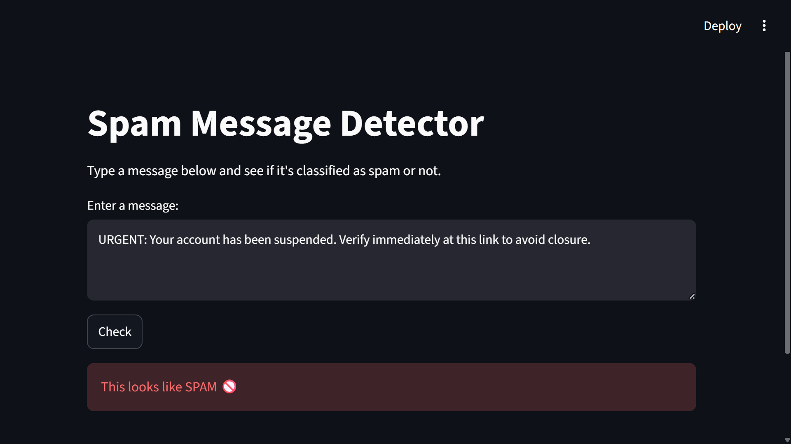

# Spam Detector — SMS Message Classifier

A machine learning model that classifies SMS text messages as **spam** or **not spam (ham)**, built end-to-end from scratch: data exploration, feature engineering, model comparison, evaluation, and a live interactive demo.

## Problem

Spam filtering is a classic text classification problem, but the interesting part isn't just "does it work" — it's the tradeoff between catching spam (recall) and not blocking real messages (precision). This project explicitly measures and reasons about that tradeoff rather than optimizing for raw accuracy, which is misleading on imbalanced data like this.

## Dataset

- **Source:** [SMS Spam Collection Dataset](https://archive.ics.uci.edu/dataset/228/sms+spam+collection) (UCI Machine Learning Repository)
- **Size:** 5,572 labeled SMS messages
- **Class balance:** 4,825 ham / 747 spam (~87% / 13%) — a real-world imbalance that shaped every modeling decision below

## Exploratory Data Analysis

- Confirmed class imbalance (87% ham, 13% spam) — ruled out plain accuracy as a fair evaluation metric
- Found spam messages average **138 characters** vs ham's **71 characters** — nearly double, and a strong standalone signal even before modeling
- Visualized message length distributions for both classes to confirm the separation

## Approach

1. **Feature engineering** — converted raw text into numeric features using TF-IDF vectorization (with English stop words removed)
2. **Modeling** — trained and compared three configurations:
   - Multinomial Naive Bayes (baseline)
   - Logistic Regression (default)
   - Logistic Regression with `class_weight='balanced'` to address the class imbalance directly
3. **Evaluation** — used precision, recall, and F1-score per class instead of raw accuracy, plus a confusion matrix to see the exact error pattern

## Results

| Model                              | Spam Precision | Spam Recall | Spam F1-score |
| ---------------------------------- | -------------- | ----------- | ------------- |
| Naive Bayes                        | 1.00           | 0.85        | 0.92          |
| Logistic Regression (default)      | 1.00           | 0.70        | 0.82          |
| **Logistic Regression (balanced)** | **0.95**       | **0.93**    | **0.94**      |

**Chosen model: Logistic Regression with balanced class weights.**

The default models were highly precise (zero false positives) but missed a meaningful share of spam — Logistic Regression's default settings in particular caught only 70% of spam. Rebalancing the class weights raised recall to 93% at the cost of 8 false positives out of 966 legitimate test messages (a 0.8% false-alarm rate). For a spam filter, missing spam is generally more costly to the user than an occasional false alarm, so this tradeoff was the deliberate choice — not the highest-precision option, but the better one for the actual use case.

## Demo

An interactive Streamlit app lets you type any message and see it classified live.




## Tech Stack

- Python, pandas, scikit-learn
- Streamlit (interactive demo)
- matplotlib (EDA visualization)

## How to Run

```bash
git clone https://github.com/rahim621-28/SPAM-DETECTOR.git
cd SPAM-DETECTOR
pip install -r requirements.txt
streamlit run app.py
```

To explore the analysis and model comparison directly, open `spamdetector.ipynb`.

## What I'd Improve Next

- Test on a larger, more diverse dataset — this one is relatively small and English-only, so performance on other languages or newer spam patterns (e.g. modern phishing links) is untested
- Try word embeddings (e.g. Word2Vec or a transformer-based encoder) instead of TF-IDF, which ignores word order and context
- Add a confidence score to the app's output instead of a binary label, so borderline cases are visible to the user
- Explore an ensemble of the two strongest models to see if it improves recall further without sacrificing precision

## Author

**RAHIM KHAN**
